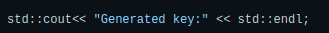
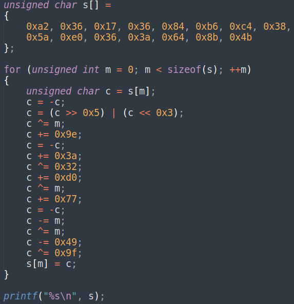

# Защита программ и данных 

Запустить можно через: 
```shell
make
```

Либо:
```shell 
g++ main.cpp -o main.o
strip main.o
./main.o
```

* [Код без обфускации](https://github.com/disc0nn3ct/Software_And_Data_Sec/blob/c63160f48a3d3cd2e223553042985c9dad6e5399/main.cpp)  
* [Код подпрограммы в программе](https://github.com/disc0nn3ct/Software_And_Data_Sec/blob/main/not%20necessary/one.c) 
* [Код с обфускацией](https://github.com/disc0nn3ct/Software_And_Data_Sec/blob/main/main.cpp)  


Пример работы: 

Когда ключ подошел: 


Когда ключ НЕ подошел: 


Описание без обфускации: 

[Код](https://github.com/disc0nn3ct/Software_And_Data_Sec/blob/c63160f48a3d3cd2e223553042985c9dad6e5399/main.cpp) без обфускации.

Краткое описание кода:

Вводятся login и pasww. -> Дополняются до 32 байт случайными символами -> Первая половина login xor со второй половиной pasww. Вторая половина login xor со первой половиной pasww результат в login-> 
В fork сыне в функции make_some_bash расшифровывается строка зашифрованная openssl 
```shell
openssl enc -d -des3 -base64 -in one.c -pass WpbV93 -pbkdf2
```
в которой спрятана [подпрограмма](https://github.com/disc0nn3ct/Software_And_Data_Sec/blob/main/not%20necessary/one.c). создается файл -> Компилируется gcc. -> выполняет команду 
```shell
date | cut -d ' ' -f 1-4 | md5sum | cut -d ' ' -f 1
```
-> передает результат через очередь сообщений под id 111, завершается -> строки login xor переданная строка. это и есть ключ. 
-> проверяется.

___

Описание методов обфускации:

Много где был использован Метод Control flow flattening (Используется switch, куски программы заключаются в множество case и куски кода программы перемешиваются, такой способ мешает понимаю структуры итоговой программы). Любая строка  была заменена на: . Так же используется проверка на подключенный дебаггер. 


Литература: 

[1] Programming Linux Anti-Reversing Techniques Jacob Baines

